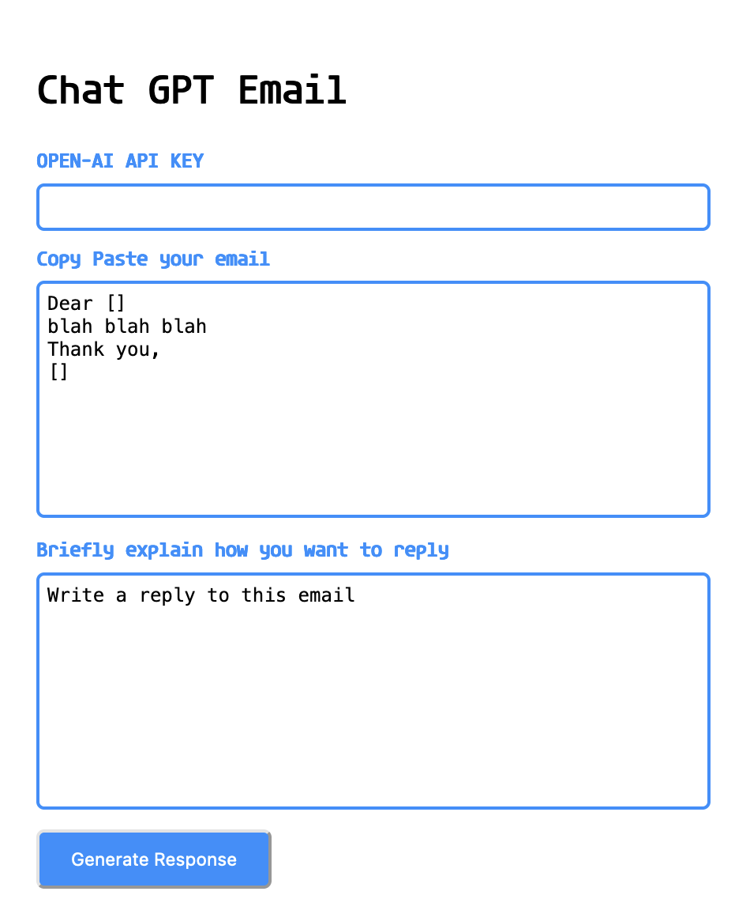

* GPT-3 emailer is a web browser extension to automate replying to emails.*

### Installation Instructions

**Google Chrome / Microsoft Edge**
* Not supported yet
  
**Mozilla Firefox**
* [Download and install the latest version](https://addons.mozilla.org/en-US/firefox/addon/gpt-3-emailer)

### Frequently asked questions
* Is it really 100% free?
  * Yes, GPT-3 Emailer is completely free to use.
* What is ChatGPT?
  * ChatGPT is a computer cprogram developed by OpenAI that uses a neural network to understand and generate natural language text. It is trained on a large amount of text data, allowing it to respond to prompts and generate text that resembles human writing.
* Does it access any sensitive email data?
  * No, GPT-3 Emailer does not access any sensitive email data. It only sends data to the AI model when writing a new email. However, there is a similar extension (closed source) that automatically fills in email data for Gmail that may potentially violate the terms of service of Gmail by accessing data without using the official API.
* Where is the API Token saved?
  * The API token is saved in your browser's storage.
* Which all languages does it support?
  * All languages ChatGPT supports
  
## Privacy
This Extension is completely ad-free, and does not collect any analytics, tracking data, or cookies. It also does not gather any user information. The only information shared with the AI model (chat.openai.com) is the prompt and context you provide when generating a response.

### Disclaimer
* Please note that GPT-3 Emailer is provided for educational purposes only and comes "AS IS" without any warranty, express or implied. The authors or copyright holders shall not be liable for any claim, damages or other liability arising from the use of this software.